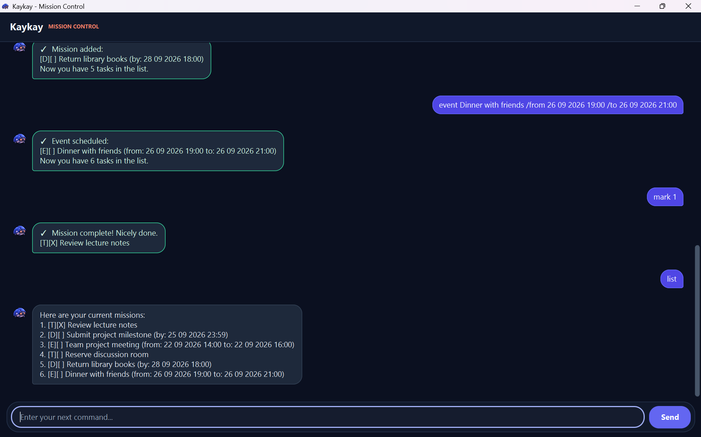

# Kaykay User Guide

Kaykay is a desktop mission-control companion for managing todos, deadlines,
events, and places. It is designed for users who prefer entering short commands
while retaining the convenience of a graphical interface.

- [Quick start](#quick-start)
- [Command format](#command-format)
- [Task features](#task-features)
- [Place features](#place-features)
- [Saving data](#saving-data)
- [FAQ](#faq)
- [Known limitations](#known-limitations)
- [Command summary](#command-summary)
- [Acknowledgements and AI declaration](#acknowledgements-and-ai-declaration)

## Quick start

1. Ensure that Java 25 is installed on your computer.
1. Download `kaykay.jar` from the
   [latest GitHub release](https://github.com/USER-LRK/ip/releases/latest).
1. Move `kaykay.jar` into the folder where you want Kaykay to store its data.
1. Open a terminal in that folder and start Kaykay with:

   ```text
   java -jar kaykay.jar
   ```

1. Enter a command in the command box and select **Send** or press **Enter**.



Here are some commands you can try:

```text
todo review lecture notes
deadline submit report /by 25 12 2026 18:30
list
place add NUS Computing /type school /location Kent Ridge
place list
```

Refer to the following sections for the complete command reference.

## Command format

The command descriptions use the following notation:

- Words in `UPPER_CASE` are values supplied by you. For example, replace
  `DESCRIPTION` in `todo DESCRIPTION` with `review lecture notes`.
- Items in square brackets are optional. For example, `[/rating RATING]` may be
  included or omitted.
- Commands and slash-prefixed field names must be entered in **lowercase**.
- For place commands, optional slash-prefixed fields may be supplied in any
  order, but each field can be used only once.
- Task and place numbers are positive integers starting from `1`.

## Task features

### Adding a todo: `todo`

Adds a task without an associated date or time.

Format: `todo DESCRIPTION`

Example:

```text
todo borrow library book
```

### Adding a deadline: `deadline`

Adds a task that must be completed by a specific date and time.

Format: `deadline DESCRIPTION /by DATE_TIME`

Example:

```text
deadline submit report /by 25 12 2026 18:30
```

The `/by` field is compulsory and can be used only once.

### Adding an event: `event`

Adds an event with a start and end date/time.

Format: `event DESCRIPTION /from START_DATE_TIME /to END_DATE_TIME`

Example:

```text
event project meeting /from 26 12 2026 14:00 /to 26 12 2026 16:00
```

The `/from` field must appear before `/to`, and the end must be later than the
start. Each field can be used only once.

### Date and time format

Deadline and event date/times use this exact format:

```text
dd MM yyyy HH:mm
```

- `dd`: two-digit day
- `MM`: two-digit month
- `yyyy`: four-digit year
- `HH`: hour in 24-hour time
- `mm`: two-digit minute

For example, `05 01 2026 06:07` means 5 January 2026 at 6:07 AM, while
`05 01 2026 18:07` means 6:07 PM. Inputs such as `Friday`, `10am`,
`2026-01-05`, or `31 02 2026 10:00` are not accepted.

### Listing all tasks: `list`

Displays all tasks in their current order.

Format: `list`

### Finding tasks: `find`

Displays tasks whose descriptions contain the supplied text.

Format: `find KEYWORD`

- The search ignores letter case. For example, `find BOOK` matches
  `borrow library book`.
- The search examines task descriptions only, not dates or task types.
- The supplied text may contain spaces, in which case Kaykay searches for that
  complete phrase.
- Matching tasks remain in their original order.

Example:

```text
find library book
```

### Marking a task as completed: `mark`

Marks the task at the specified number as completed.

Format: `mark TASK_NUMBER`

Example:

```text
mark 1
```

### Marking a task as not completed: `unmark`

Marks the task at the specified number as not completed.

Format: `unmark TASK_NUMBER`

Example:

```text
unmark 1
```

### Deleting a task: `delete`

Permanently removes the task at the specified number.

Format: `delete TASK_NUMBER`

Example:

```text
delete 2
```

> **Important:** `mark`, `unmark`, and `delete` use the numbers shown by `list`.
> Numbers shown in `find` results do not replace the task's number in the full
> list. Run `list` before changing a task if you are unsure of its number.

### Exiting Kaykay: `bye`

Ends the current Kaykay session and disables further command entry. Close the
application window when you are finished.

Format: `bye`

## Place features

Places are stored independently from tasks. For example,
`todo visit Burnt Ends` creates a task; only `place add` creates a place record.

### Adding a place: `place add`

Saves a place. A name is required; all other fields are optional.

Format:

```text
place add NAME [/type TYPE] [/location LOCATION] [/visited DATE] [/rating RATING] [/notes NOTES]
```

Example:

```text
place add Burnt Ends /type restaurant /location Dempsey /visited 10 09 2026 /rating 5 /notes Great brisket
```

- `DATE` uses `dd MM yyyy`, without a time.
- `RATING` must be a whole number from `1` to `5`.
- Optional fields may be entered in any order.

### Listing all places: `place list`

Displays all saved places in their current order.

Format: `place list`

### Finding places: `place find`

Displays places for which any recorded detail contains the supplied text.

Format: `place find KEYWORD`

The search ignores letter case and checks the name, type, location, visit date,
rating, and notes. The supplied text may contain spaces.

Example:

```text
place find restaurant
```

### Editing a place: `place edit`

Replaces one or more details of a saved place. Details that are not supplied
remain unchanged.

Format:

```text
place edit PLACE_NUMBER [/name NAME] [/type TYPE] [/location LOCATION] [/visited DATE] [/rating RATING] [/notes NOTES]
```

Examples:

```text
place edit 1 /rating 4 /notes Worth revisiting
place edit 2 /name School of Computing /location COM1
```

At least one field must be supplied. Existing fields cannot currently be
cleared; each supplied field requires a value.

### Deleting a place: `place delete`

Permanently removes the place at the specified number.

Format: `place delete PLACE_NUMBER`

Example:

```text
place delete 2
```

> **Important:** `place edit` and `place delete` use the numbers shown by
> `place list`. Numbers shown in `place find` results do not replace the place's
> number in the full list. Run `place list` before changing a place if you are
> unsure of its number.

## Duplicate entries

Kaykay does not add a task or place when all its details exactly match an
existing entry. Entries with the same description or name but different types,
dates, times, or other details are allowed.

## Saving data

Kaykay saves every successful change automatically. No manual save command is
required. Tasks and places are stored together in `data/kaykay.txt`, relative
to the folder from which Kaykay is started.

> **Caution:** The data file is intended to be managed by Kaykay. Editing it
> manually can make it invalid. If Kaykay cannot load an existing data file, it
> protects the file by blocking further writes for that session so that the
> original data can be repaired.

Save files containing older free-form deadline or event dates are not
compatible with the current date/time format and must be repaired or recreated.

## FAQ

**How do I transfer my data to another computer?**

Copy `data/kaykay.txt` to the corresponding `data` folder on the other
computer. Back up the destination file first if it already contains data you
want to keep.

**Why does a task or place number appear to target a different entry after a
search?**

Search results are numbered for display only. Use `list` or `place list` to see
the numbers accepted by commands that change or delete entries.

**Does Kaykay save my changes when I close the window?**

Yes. Kaykay saves each successful change immediately, rather than waiting for
the application to close.

## Known limitations

- There is no command for clearing an optional place field once it has a value;
  `place edit` can only replace it.
- Task and place searches do not create a persistent filtered list, so update
  and delete commands continue to use numbers from the full lists.

## Command summary

| Action | Format |
| --- | --- |
| Add a todo | `todo DESCRIPTION` |
| Add a deadline | `deadline DESCRIPTION /by DATE_TIME` |
| Add an event | `event DESCRIPTION /from START_DATE_TIME /to END_DATE_TIME` |
| List tasks | `list` |
| Find tasks | `find KEYWORD` |
| Mark a task | `mark TASK_NUMBER` |
| Unmark a task | `unmark TASK_NUMBER` |
| Delete a task | `delete TASK_NUMBER` |
| Add a place | `place add NAME [OPTIONAL_FIELDS]` |
| List places | `place list` |
| Find places | `place find KEYWORD` |
| Edit a place | `place edit PLACE_NUMBER FIELD VALUE [MORE_FIELDS]` |
| Delete a place | `place delete PLACE_NUMBER` |
| Exit | `bye` |

## Acknowledgements and AI declaration

- Kaykay is based on the
  [CS2103T individual project starter repository](https://github.com/NUS-CS2103-AY2627-S1/ip)
  and its Duke learning increments.
- The application uses [OpenJFX](https://openjfx.io/) for its graphical user
  interface. [JUnit 5](https://junit.org/junit5/),
  [Checkstyle](https://checkstyle.org/), and the
  [Gradle Shadow plugin](https://gradleup.com/shadow/) support testing, code
  quality checks, and JAR packaging respectively.
- This guide's organization was informed by the
  [AddressBook Level 3 User Guide](https://se-education.org/addressbook-level3/UserGuide.html).
- OpenAI Codex was used to assist with implementation, refactoring,
  test creation, UI development, debugging, review, and documentation. The
  Kaykay mascot was created with OpenAI's image-generation tool. All
  AI-assisted output was reviewed, adapted where needed, and verified by the
  project author, who remains responsible for the submitted work.

[Return to the project README](../README.md)
